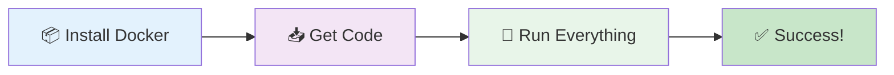
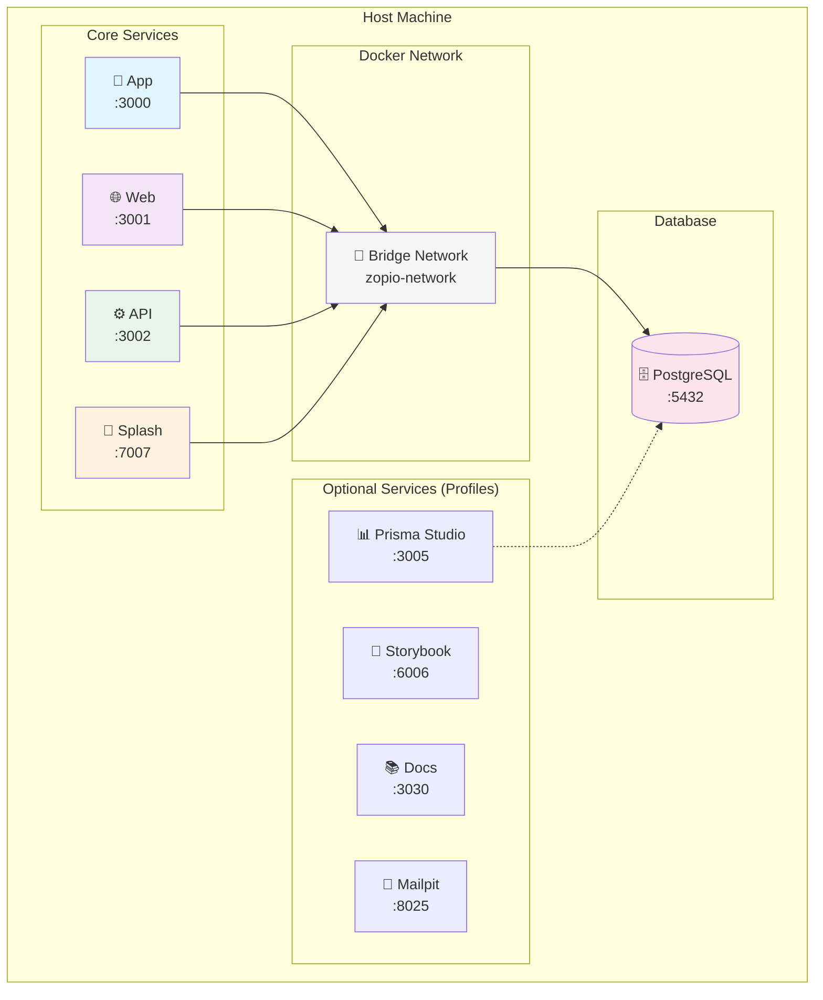
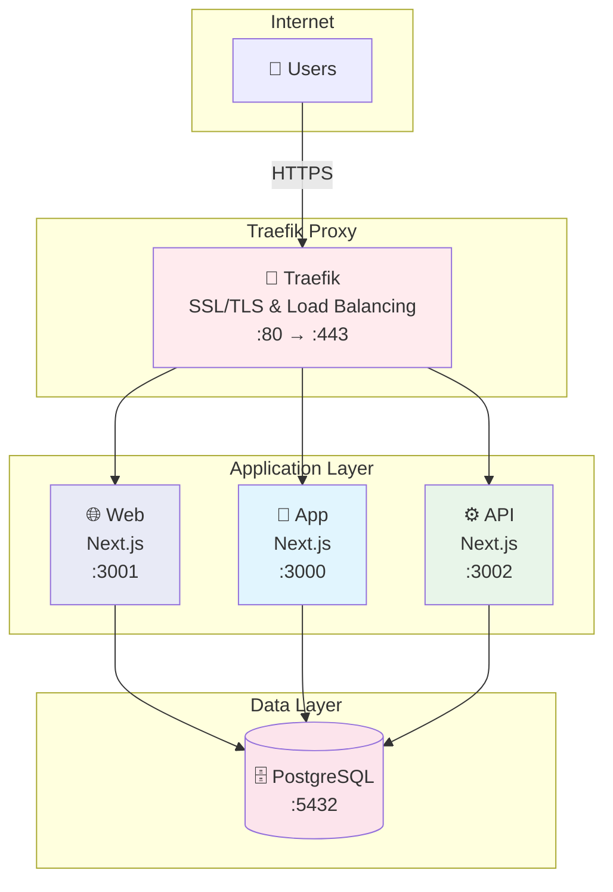

<div align="center">

# 🐳 Docker Setup for Zopio Monorepo

<p align="center">
  
</p>

[](https://www.docker.com/)
[](https://docs.docker.com/compose/)
[](https://nodejs.org/)
[](https://pnpm.io/)
[](https://www.postgresql.org/)

### **Run your entire Zopio monorepo with a single command** 🚀

<p align="center">
  <a href="#-quick-start-for-non-developers"></a>
  <a href="#-development-environment"></a>
  <a href="#-production-environment"></a>
</p>

</div>

<div align="center">
  <sub>Built with ❤️ by the Zopio Team • <a href="#-support">Get Help</a> • <a href="../../issues">Report Issues</a></sub>
</div>

---

> 📖 **About:** This directory contains Docker configurations for running the Zopio monorepo in both development and production environments.

## 📚 Table of Contents

<table>
<tr>
<td width="33%" valign="top">

### 🚀 Getting Started

- [⚡ Prerequisites](#-prerequisites)
- [🎯 Quick Start](#-quick-start-for-non-developers)
- [💻 Development Setup](#-development-environment)
- [🚀 Production Setup](#-production-environment)

</td>
<td width="33%" valign="top">

### 📖 Documentation

- [🏗️ Architecture](#️-service-architecture)
- [⌨️ Commands](#️-common-commands)
- [🎛️ Docker Profiles](#️-using-docker-compose-profiles)
- [🔐 Environment Variables](#-environment-variables)

</td>
<td width="33%" valign="top">

### 🛠️ Reference

- [🔧 Troubleshooting](#-troubleshooting)
- [🔒 Security Checklist](#-security--production-checklist)
- [💾 Backup & Restore](#-database-backup--restore)
- [📖 Glossary](#-glossary)

</td>
</tr>
</table>

## ⚡ Prerequisites

| Requirement | Minimum | Recommended |
|------------|---------|-------------|
| 🐳 Docker Desktop | 4.20+ | Latest |
| 💾 RAM | 8GB | 16GB |
| 💿 Disk Space | 20GB | 50GB |
| 🖥️ OS | macOS 11+, Windows 10+, Linux | Latest stable |

### OS-Specific Requirements

**🍎 macOS:**

- macOS 11 Big Sur or newer
- Apple Silicon (M1/M2/M3) or Intel processor
- Virtualization must be enabled

**🪟 Windows:**

- Windows 10 64-bit: Pro, Enterprise, or Education (Build 19041 or higher)
- Windows 11 64-bit
- WSL 2 backend (recommended) or Hyper-V
- Virtualization enabled in BIOS

**🐧 Ubuntu/Linux:**

- Ubuntu 20.04 LTS or newer
- 64-bit kernel and CPU support for virtualization
- KVM virtualization support

## 🎯 Quick Start for Non-Developers

> [!TIP]
> **New to Docker?** No worries! Follow these simple steps to get Zopio running in minutes.

<div align="center">
  
### 🎢 Get Zopio Running in 3 Steps



</div>

If you just want to run the Zopio applications without understanding the technical details:

### 1️⃣ Step 1: Install Docker Desktop

**🍎 macOS:**

1. Download Docker Desktop from [docker.com](https://www.docker.com/products/docker-desktop/)
2. Open the `.dmg` file and drag Docker to Applications
3. Launch Docker from Applications
4. You'll see the 🐳 whale icon in your menu bar when running

**🪟 Windows:**

1. Download Docker Desktop from [docker.com](https://www.docker.com/products/docker-desktop/)
2. Run the installer as Administrator
3. Enable WSL 2 when prompted (recommended)
4. Restart your computer if required
5. Launch Docker Desktop from Start Menu
6. You'll see the 🐳 whale icon in your system tray when running

**🐧 Ubuntu/Linux:**

```bash
# Install Docker Engine (not Docker Desktop)
sudo apt-get update
sudo apt-get install -y docker.io docker-compose-v2
sudo systemctl start docker
sudo systemctl enable docker
# Add your user to docker group (logout/login required)
sudo usermod -aG docker $USER
```

### 2️⃣ Step 2: Get the Code

```bash
# Clone the repository (if you haven't already)
git clone <repository-url>
cd zopio-1
```

### 3️⃣ Step 3: Run Everything

```bash
# Copy the example environment file
cp docker/dev.env.example docker/dev.env

# Start all services (this will take a few minutes the first time)
cd docker
docker compose -f docker-compose.dev.yml up
```

### 4️⃣ Step 4: Access the Applications

> [!SUCCESS]
> Once everything is running (you'll see logs streaming in your terminal), your applications are ready!

<div align="center">

| Application | URL | Description | Status |
|:------------|:---:|:------------|:------:|
| 🎨 **Main App** | [localhost:3000](http://localhost:3000) | Primary application interface | 🟢 Ready |
| 🌟 **Marketing Website** | [localhost:3001](http://localhost:3001) | Public-facing marketing site | 🟢 Ready |
| ⚙️ **API** | [localhost:3002](http://localhost:3002) | Backend API services | 🟢 Ready |

</div>

> [!WARNING]
> **To stop everything:** Press `Ctrl+C` in the terminal.

---

## 💻 Development Environment

### 🏃 Quick Start

> [!TIP]
> Follow these steps to set up your development environment quickly.

1. Copy the environment template:

```bash
cp docker/dev.env.example docker/dev.env
```

2. Edit `docker/dev.env` with your configuration

3. Start all services:

```bash
cd docker
docker compose -f docker-compose.dev.yml up
```

4. **Access the applications:**

   | Service | Port | URL | Description |
   |---------|------|-----|-------------|
   | 🎨 App | `3000` | <http://localhost:3000> | Main application |
   | 🌐 Web | `3001` | <http://localhost:3001> | Marketing site |
   | ⚙️ API | `3002` | <http://localhost:3002> | Backend services |
   | 🌟 Splash | `7007` | <http://localhost:7007> | Marketing splash page |
   | 🗄️ Database | `5432` | localhost:5432 | PostgreSQL |

5. Run database migrations (first time only):

```bash
# The migrate service uses a profile, so you need to specify it
docker compose -f docker-compose.dev.yml --profile migrate up migrate
```

---

## 🚀 Production Environment

> [!IMPORTANT]
> Ensure all security checklists are completed before deploying to production!

1. Copy and configure environment:

```bash
cp docker/prod.env.example docker/prod.env
# Edit prod.env with production values
```

2. Build and start services:

```bash
cd docker
# Pass env file explicitly for compose-time variable interpolation
docker compose --env-file prod.env -f docker-compose.prod.yml up -d
```

3. Run database migrations:

```bash
docker compose --env-file prod.env -f docker-compose.prod.yml --profile migrate up migrate
```

### 🔐 With Traefik Proxy

> [!TIP]
> **Production Ready:** Deploy with Traefik for automatic SSL/TLS and domain routing

```bash
docker compose --env-file prod.env -f docker-compose.prod.yml -f docker-compose.proxy.yml up -d
```

#### ⚠️ Traefik Security Hardening

> **IMPORTANT:** Follow these steps before going to production!

1. **🔑 Replace the placeholder basicauth hash** in `docker/docker-compose.proxy.yml`
2. **🔐 Generate a secure bcrypt hash:**

  ```bash
  htpasswd -nbB admin 'yourpassword' | sed -e 's/\\$/$$/g'
  ```

3. **📝 Update configuration:**

   ```yaml
   traefik.http.middlewares.auth.basicauth.users=admin:<escaped-hash>
   ```

4. **🔒 Additional security steps:**
   - ✅ Uncomment ACME flags for Let's Encrypt
   - ✅ Set a valid email address for certificates
   - ✅ Update Host rules from `*.localhost` to your real domains
   - ✅ Remove direct host port mappings when using Traefik

> 📌 **Environment Variables Best Practice:**
>
> - `--env-file` flag → Compose-time variable interpolation
> - `env_file` in services → Runtime container variables
> - Database uses `env_file` to avoid empty password warnings

---

## 🏗️ Service Architecture

### Development Architecture



### Production Architecture with Traefik



## 🛠️ Development Features

<div align="center">

| Feature | Description | Details |
|:--------|:------------|:--------|
| 🔥 **Hot Reload** | Live code updates | All Next.js apps with HMR |
| 📁 **Volume Mounts** | Live editing | Source code synced in real-time |
| 📦 **Shared pnpm Store** | Fast installs | Cached dependencies in `pnpm_store` |
| 💾 **Database Persistence** | Data preservation | PostgreSQL data in `postgres_data` |
| 🏥 **Health Checks** | Service dependencies | Automatic startup ordering |
| 🏷️ **Container Names** | Easy identification | Pattern: `zopio_image_{service}_dev` |

</div>

### 🎛️ Using Docker Compose Profiles

> 💡 **Pro Tip:** Use profiles to start only the services you need!

Optional services are organized with profiles for selective startup:

```bash
# Start core services only (db, web, app, api)
docker compose -f docker-compose.dev.yml up

# Include marketing website
docker compose -f docker-compose.dev.yml --profile marketing up

# Include documentation server
docker compose -f docker-compose.dev.yml --profile docs up

# Include Prisma Studio (database GUI on port 3005)
docker compose -f docker-compose.dev.yml --profile dbstudio up

# Include Storybook (component library on port 6006)
docker compose -f docker-compose.dev.yml --profile storybook up

# Include email testing with Mailpit
docker compose -f docker-compose.dev.yml --profile mailpit up

# Include Redis cache
docker compose -f docker-compose.dev.yml --profile redis up

# Include Stripe CLI for webhook forwarding
docker compose -f docker-compose.dev.yml --profile stripe-cli up

# Combine multiple profiles
docker compose -f docker-compose.dev.yml --profile marketing --profile docs up

# Run database migrations (one-time operation)
docker compose -f docker-compose.dev.yml --profile migrate up migrate
```

#### 📊 Available Profiles

<div align="center">

| Profile | Service | Ports | Description | Command |
|:--------|:--------|:-----:|:------------|:--------|
| 🔄 **migrate** | Database Migrations | - | Runs once and exits | `--profile migrate` |
| 🌟 **marketing** | Splash Website | `7007` | Marketing landing page | `--profile marketing` |
| 📚 **docs** | Documentation | `3030` | Mintlify docs server | `--profile docs` |
| 🗄️ **dbstudio** | Prisma Studio | `3005` | Database GUI | `--profile dbstudio` |
| 🎨 **storybook** | Component Library | `6006` | UI component development | `--profile storybook` |
| 📧 **mailpit** | Email Testing | `1025`, `8025` | SMTP server & Web UI | `--profile mailpit` |
| ⚡ **redis** | Cache | `6379` | Redis cache service | `--profile redis` |
| 💳 **stripe-cli** | Stripe Webhooks | - | Payment webhook forwarding | `--profile stripe-cli` |

</div>

## 🏭 Production Features

<div align="center">

| Feature | Description | Benefit |
|:--------|:------------|:--------|
| 📦 **Multi-stage Builds** | Next.js standalone mode | ~70% smaller images |
| 👤 **Non-root Users** | Dedicated app users (uid: 1001) | Enhanced security |
| 📊 **Resource Limits** | CPU & memory constraints | Stability & predictability |
| 🏥 **Health Checks** | Automated monitoring | Self-healing services |
| 🔐 **Network Isolation** | Internal `zopio-network` | Secure communication |
| 📈 **Scalability** | No fixed container names | Easy horizontal scaling |

</div>

---

## ⌨️ Common Commands

> 💡 **Note for Windows Users:**
>
> - Use PowerShell or WSL 2 for best compatibility
> - In PowerShell, use `` ` `` for line continuation instead of `\`
> - Paths use forward slashes `/` even on Windows when using Docker

### 🔧 Development Commands

```bash
# Start all services
docker compose -f docker-compose.dev.yml up

# Start specific service
docker compose -f docker-compose.dev.yml up app

# Rebuild after dependency changes
docker compose -f docker-compose.dev.yml build --no-cache

# View logs
docker compose -f docker-compose.dev.yml logs -f app

# Execute commands in container
docker compose -f docker-compose.dev.yml exec app pnpm test

# Stop all services
docker compose -f docker-compose.dev.yml down

# Clean everything (including volumes)
docker compose -f docker-compose.dev.yml down -v
```

### 🚀 Production Commands

```bash
# Build images
docker compose --env-file prod.env -f docker-compose.prod.yml build

# Start services (detached)
docker compose --env-file prod.env -f docker-compose.prod.yml up -d

# View logs
docker compose --env-file prod.env -f docker-compose.prod.yml logs -f

# Scale services (now possible without container_name conflicts)
docker compose --env-file prod.env -f docker-compose.prod.yml up -d --scale api=3

# Update single service
docker compose --env-file prod.env -f docker-compose.prod.yml up -d --no-deps app

# Backup database
docker compose --env-file prod.env -f docker-compose.prod.yml exec -T db pg_dump -U postgres zopio > backup.sql

# Run migrations (using profile)
docker compose --env-file prod.env -f docker-compose.prod.yml --profile migrate up migrate
```

---

## 🔐 Environment Variables

### ⚠️ Required Variables

| Variable | Description | Example |
|----------|-------------|----------|
| `DATABASE_URL` | PostgreSQL connection | `postgresql://user:pass@db:5432/zopio` |
| `NODE_ENV` | Environment mode | `development` or `production` |

### 📋 Optional Variables

> 📄 See `dev.env.example` and `prod.env.example` for all available options.

---

## 🔧 Troubleshooting

### 🐳 Container-Specific Issues

To debug a specific container:

```bash
# View logs for a specific container
docker logs zopio_image_app_dev

# Execute commands in a running container
docker exec -it zopio_image_app_dev sh

# List all containers with their status
docker ps -a | grep zopio_image
```

### 🔥 File Watching & Hot Reload Issues

**🍎 macOS:**

> [!INFO]
> Hot reload configuration is already included in the environment!

```yaml
# Already configured in dev.env
CHOKIDAR_USEPOLLING=1
WATCHPACK_POLLING=true
```

If hot reload still doesn't work:

- Ensure Docker Desktop has file sharing permissions for your project folder
- Go to Docker Desktop → Settings → Resources → File Sharing

**🪟 Windows:**
For WSL 2 users, hot reload should work out of the box. For Hyper-V backend:

```yaml
# Add to dev.env if not working
CHOKIDAR_USEPOLLING=1
WATCHPACK_POLLING=true
WATCHPACK_POLLING_INTERVAL=1000
```

Also ensure:

- Docker Desktop → Settings → Resources → File Sharing includes your project drive
- Windows Defender isn't blocking file system events

**🐧 Ubuntu/Linux:**
If you encounter "ENOSPC" errors, increase inotify watchers:

```bash
# Check current limit
cat /proc/sys/fs/inotify/max_user_watches

# Increase limit (temporary)
sudo sysctl fs.inotify.max_user_watches=524288

# Make permanent
echo 'fs.inotify.max_user_watches=524288' | sudo tee -a /etc/sysctl.conf
sudo sysctl -p
```

### 🔌 Port Conflicts

**If ports are already in use:**

**🍎 macOS:**

```bash
# Find what's using a port (e.g., 3000)
lsof -i :3000
# Kill the process
kill -9 <PID>
```

**🪟 Windows:**

```powershell
# In PowerShell (as Administrator)
# Find what's using a port (e.g., 3000)
netstat -ano | findstr :3000
# Kill the process
taskkill /PID <PID> /F
```

**🐧 Ubuntu/Linux:**

```bash
# Find what's using a port (e.g., 3000)
sudo lsof -i :3000
# Or
sudo netstat -tulpn | grep :3000
# Kill the process
sudo kill -9 <PID>
```

**Alternative:** Modify port mappings in docker-compose files:

```yaml
ports:
  - "3001:3000"  # Map to different host port
```

### 🗄️ Database Connection Issues

1. Ensure database is healthy:

```bash
docker compose -f docker-compose.dev.yml ps db
```

2. Check database logs:

```bash
docker compose -f docker-compose.dev.yml logs db
```

3. Reset database (warning: data loss):

```bash
docker compose -f docker-compose.dev.yml down -v
docker compose -f docker-compose.dev.yml up db
```

### 🧹 Build Cache Issues

**Clear Docker build cache:**

```bash
docker builder prune -af
```

### 📁 File Permission Issues

**🐧 Ubuntu/Linux:**
If you encounter permission errors:

```bash
# Fix ownership for generated files
sudo chown -R $USER:$USER .

# Or run containers with your user ID
docker compose -f docker-compose.dev.yml run --user $(id -u):$(id -g) app sh
```

**🪟 Windows:**

- Ensure your project is on a local NTFS drive (not a network drive)
- If using WSL 2, clone the project inside WSL filesystem for better performance:

```bash
# Clone in WSL home directory
cd ~/
git clone <repository-url>
```

**🍎 macOS:**

- Docker Desktop should handle permissions automatically
- If issues persist, check Docker Desktop → Settings → Resources → File Sharing

### 💾 Memory Issues

**🍎 macOS:**

1. Open Docker Desktop → Settings (⚙️)
2. Go to Resources → Advanced
3. Increase Memory to 8GB+ (drag the slider)
4. Click "Apply & Restart"

**🪟 Windows:**

1. Open Docker Desktop → Settings (⚙️)
2. Go to Resources → Advanced
3. Increase Memory to 8GB+ (drag the slider)
4. Click "Apply & Restart"

**Note for WSL 2:** You may also need to configure `.wslconfig` in your Windows home directory:

```ini
# %USERPROFILE%\.wslconfig
[wsl2]
memory=8GB
processors=4
```

**🐧 Ubuntu/Linux:**
Docker Engine uses available system memory. Check current usage:

```bash
# Check Docker memory usage
docker system df
docker stats --no-stream

# If needed, configure memory limits in daemon.json
sudo nano /etc/docker/daemon.json
```

---

## 🔄 CI/CD Integration

**For CI/CD pipelines, use build arguments:**

```bash
docker build \
  --build-arg TURBO_TEAM=your-team \
  --build-arg TURBO_TOKEN=your-token \
  --target runner \
  -f apps/app/Dockerfile \
  -t your-registry/app:latest \
  .
```

## 🏗️ Multi-Architecture Builds

**Build for multiple platforms:**

```bash
docker buildx build \
  --platform linux/amd64,linux/arm64 \
  -f apps/app/Dockerfile \
  -t your-registry/app:latest \
  --push \
  .
```

## 🔒 Security Notes

> [!CAUTION]
> **Critical Security Guidelines**

| ❌ Never Do | ✅ Always Do |
|-------------|-------------|
| Commit `.env` files | Use `.env.example` templates |
| Use weak passwords | Generate strong, unique passwords |
| Skip SSL/TLS | Enable HTTPS in production |
| Ignore updates | Regularly update base images |
| Hardcode secrets | Use secrets management |
| Skip network policies | Implement proper isolation |

## ⚡ Performance Optimization

| Optimization | Description | Impact |
|-------------|-------------|--------|
| 🏗️ **BuildKit** | Modern build engine | 2-3x faster builds |
| 📦 **Layer Caching** | Optimized Dockerfile order | Skip unchanged layers |
| 🔗 **pnpm Store** | Shared dependencies | 50% faster installs |
| 🚀 **Turbo Cache** | Remote caching | Team-wide speedup |
| 📉 **Standalone Mode** | Next.js optimization | 70% smaller images |

---

## 🔒 Security & Production Checklist

### ✅ Before Going to Production

<details>
<summary><b>🔐 Environment Variables</b></summary>

- [ ] All secrets are in `prod.env` (never commit!)
- [ ] DATABASE_URL uses a strong password
- [ ] All API keys are production keys
- [ ] NODE_ENV=production is set

</details>

<details>
<summary><b>🛡️ Traefik Security</b></summary>

- [ ] Replace default basicauth hash
- [ ] Configure Let's Encrypt with valid email
- [ ] Update all Host rules to real domains
- [ ] Disable or secure Traefik dashboard

</details>

<details>
<summary><b>🗄️ Database</b></summary>

- [ ] Set up automated backups
- [ ] Test restore procedure
- [ ] Configure connection pooling
- [ ] Set appropriate resource limits

</details>

<details>
<summary><b>📊 Monitoring</b></summary>

- [ ] Set up log aggregation
- [ ] Configure health check alerts
- [ ] Monitor resource usage
- [ ] Set up uptime monitoring

</details>

<details>
<summary><b>🔒 Security</b></summary>

- [ ] Review and update all base images
- [ ] Scan images for vulnerabilities
- [ ] Implement rate limiting
- [ ] Configure CORS properly
- [ ] Set up WAF if needed

</details>

<div align="center">
  
</div>

### 💾 Database Backup & Restore

#### 📤 Backup

```bash
# Create backup
docker compose --env-file prod.env -f docker-compose.prod.yml exec -T db \
  pg_dump -U postgres zopio > backup_$(date +%Y%m%d_%H%M%S).sql

# Compressed backup
docker compose --env-file prod.env -f docker-compose.prod.yml exec -T db \
  pg_dump -U postgres zopio | gzip > backup_$(date +%Y%m%d_%H%M%S).sql.gz
```

#### 📥 Restore

```bash
# Restore from backup
cat backup.sql | docker compose --env-file prod.env -f docker-compose.prod.yml exec -T db \
  psql -U postgres zopio

# Restore from compressed backup
gunzip -c backup.sql.gz | docker compose --env-file prod.env -f docker-compose.prod.yml exec -T db \
  psql -U postgres zopio
```

---

## 📖 Glossary

<details>
<summary><b>Click to expand terminology guide</b></summary>

| Term | Definition |
|------|------------|
| **Container** 📦 | A lightweight, standalone package with everything needed to run software |
| **Docker Compose** 🐳 | Tool for defining and running multi-container applications |
| **Image** 💿 | Read-only template for creating containers |
| **Volume** 💾 | Persistent data storage for containers |
| **Port Mapping** 🔌 | Connecting host port to container port (e.g., `3000:3000`) |
| **Environment Variable** 🔐 | Configuration values in `.env` files |
| **Profile** 🎛️ | Group of optional services |
| **Health Check** 🏥 | Automated service monitoring |
| **Migration** 🔄 | Database schema updates |
| **Hot Reload** 🔥 | Auto-restart on code changes |

</details>

---

## 🆘 Support

<div align="center">

### **Need help? We're here for you!**

| Resource | Description | Link |
|:---------|:------------|:----:|
| 📖 **Documentation** | This comprehensive README | [You're here!](#) |
| 📝 **Docker Logs** | Check container logs | `docker compose logs` |
| 🔍 **Debug Mode** | Enable verbose logging | Set `DEBUG=true` |
| 🐛 **Issues** | Report bugs or request features | [GitHub Issues](../../issues) |
| 💬 **Discussions** | Ask questions, share ideas | [GitHub Discussions](../../discussions) |
| 📧 **Contact** | Direct support | [Contact Team](mailto:support@zopio.com) |

</div>

---

<div align="center">

### 🎆 Contributing

<p align="center">
  <a href="../../contributing.md">
    
  </a>
  <a href="../../issues">
    
  </a>
  <a href="../../pulls">
    
  </a>
</p>

### 📈 Project Stats

<p align="center">
  
  
  
  
</p>

<br/>

<h3>Built with ❤️ by the Zopio Team</h3>

<p align="center">
  <sub>© 2025 Zopio. All rights reserved.</sub>
</p>

<p align="center">
  <a href="#-docker-setup-for-zopio-monorepo">↑ Back to Top</a>
</p>

</div>
